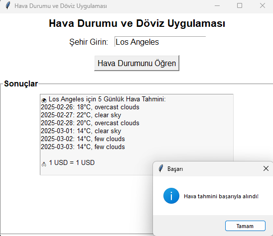

# Hava Durumu ve Döviz Uygulaması

Bu Python ile geliştirilmiş **hava durumu ve döviz kuru uygulaması**, OpenWeatherMap ve ExchangeRate-API kullanarak güncel verileri alır.

## Kullanılan Teknolojiler:
✅ Python (Tkinter GUI)  
✅ OpenWeatherMap API  
✅ ExchangeRate API  
✅ JSON veri kaydı  

## Özellikler:
🔹 Şehir girerek hava durumunu öğrenme  
🔹 5 günlük sıcaklık tahminlerini gösterme  
🔹 Döviz kuru bilgisi alma  
🔹 JSON olarak verileri kaydetme  

## Kullanım:
1. Terminali açın ve şu komutu çalıştırın:
```
python main.py
```
2. Açılan pencereye şehir adını yazın ve **"Hava Durumunu Öğren"** butonuna tıklayın.
3. Anlık hava durumu ve döviz kuru bilgilerini görüntüleyin.

## Ekran Görüntüsü


---
🎯 **Proje Sahibi:** [@alpercevizz](https://github.com/alpercevizz)  
🔗 **GitHub:** [Hava Durumu Uygulaması](https://github.com/alpercevizz/hava-durumu-uygulamasi)